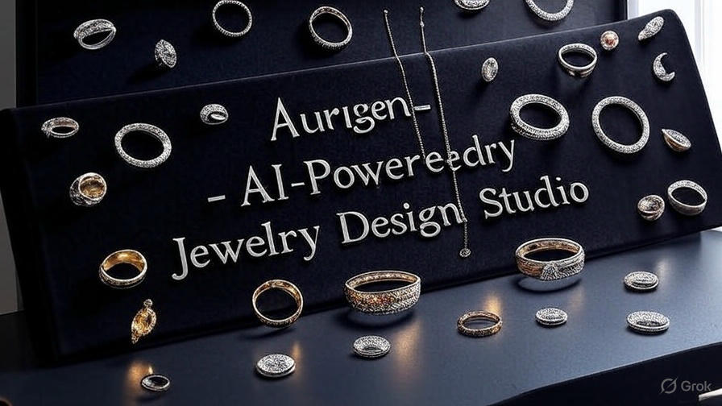
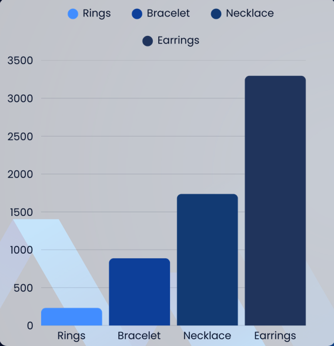
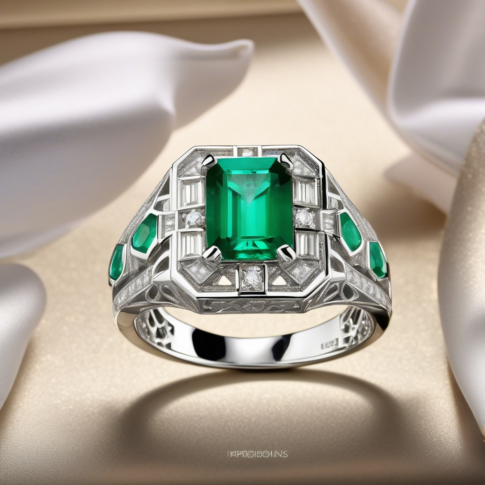
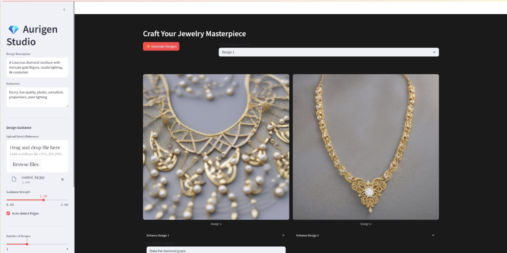

# 💍 Aurigen - AI-Powered Jewelry Design Studio

Aurigen is an AI-powered jewelry design studio that uses **Stable Diffusion XL** and **ControlNet** to generate stunning, customized jewelry designs based on user prompts or sketches. Our system helps users visualize their dream jewelry before it's crafted — making the personalization process easier, faster, and more creative than ever before.



---

## 🚩 Problem Statement

In traditional jewelry design, users are often forced to rely on rough sketches or verbal descriptions, with little control or clarity until the final product is delivered. This often leads to **design mismatches**, **costly revisions**, and **poor satisfaction**.

> 💡 We aim to eliminate this uncertainty using generative AI — allowing users to explore realistic designs before making decisions.

---

## ✨ Key Features

- 🎨 **Text-to-Image Jewelry Generation**  
  Describe your dream piece and watch it come to life using **Stable Diffusion XL**.

- 🧠 **Structure-Aware with ControlNet**  
  Upload rough sketches or let the system auto-detect edges to guide the generation process.

- 🛠 **Real-Time Design Studio**  
  Built with **Streamlit**, our interface allows users to fine-tune prompts, guidance, and even refine specific features in real time.

- 📁 **Novel Jewelry Dataset**  
  A self-curated dataset of 6000+ annotated images across 4 categories: `Earrings`, `Necklaces`, `Rings`, and `Bracelets`.

---

## 🧠 Tech Stack

| Area            | Technologies                                                  |
| --------------- | ------------------------------------------------------------- |
| Core ML Models  | Stable Diffusion XL, ControlNet                               |
| ML Frameworks   | PyTorch, Hugging Face `diffusers`, OpenCV                     |
| UI & Deployment | Streamlit, HTML/CSS, PIL, NumPy                               |
| Dataset Tools   | Custom scripts, Gemini API (Image-to-Text), Manual Annotation |

---

## 📊 Dataset Overview

- 📦 **Total Images**: 6000+
- 💎 **Classes**: Rings, Necklaces, Earrings, Bracelets
- 🧹 **Cleaned and Annotated**: Removed duplicates, filtered poor quality, generated captions using Gemini, and manually verified.

### Dataset Breakdown

- **Rings**: 233 images
- **Bracelets**: 888 images
- **Necklaces**: 1,738 images
- **Earrings**: 3,298 images

## 

## 🖼 Sample Results

| Prompt                                                             | Generated Design                                                                |
| ------------------------------------------------------------------ | ------------------------------------------------------------------------------- |
| _"An emerald and diamond ring in 18k white gold, art deco style"_  |         |
| _"A luxurious golden necklace with floral motifs and ruby stones"_ |  |

---

## 🧪 Demo

Want to try it yourself?  
🚀 Run the app locally:

```bash
git clone https://github.com/CodeNinjaSarthak/Aurigen-AI-Powered-Jewelry-Design-Studio.git
cd Aurigen-AI-Powered-Jewelry-Design-Studio
pip install -r requirements.txt
streamlit run app.py
```

<h3> Watch it in action: <h3>
https://drive.google.com/file/d/1UnwEjkt5vYjoJlum6DXiLO72CQdbBcFo/view?usp=sharing

https://github.com/user-attachments/assets/cd38b971-ac3b-485e-b4b5-b23f650ea11d


<h3>Download the trained model from below link and place it in fine-tuned-weights folder</h3>
https://drive.google.com/drive/folders/13bx0xMu9Py2vFqFG8ocny2YVamw7EQOX?usp=sharing

## 👥 Contributors

- **Sidharth Patel (E22CSEU0044)**: Model Development, Dataset (Rings)
- **Sarthak Chauhan (E22CSEU0054)**: Model Development, Dataset (Bracelets)
- **Vrinda Singh Parmar (E22CSEU0043)**: Model Development, Dataset (Necklaces)
- **Shlok Bhardwaj (E22CSEU0041)**: Model Development, Dataset (Earrings)
