# Aurigen — AI-Powered Jewelry Design Studio

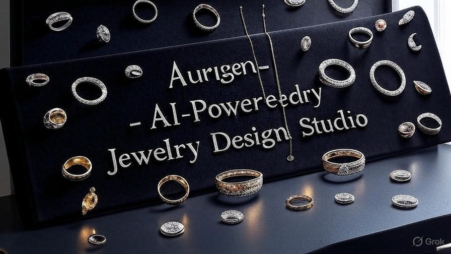

Generate photorealistic, customized jewelry designs from text prompts using **fine-tuned Stable Diffusion XL** and **ControlNet**. Visualize your dream jewelry before it's crafted — no sketches, no guesswork.

[](https://www.python.org/)
[](https://pytorch.org/)
[](https://streamlit.io/)
[](LICENSE)

---

## Problem

In traditional jewelry design, customers rely on rough sketches or verbal descriptions with little control or clarity until the final product is delivered. This leads to **design mismatches**, **costly revisions**, and **poor satisfaction**. There are currently no dedicated AI tools focused on jewelry design generation — existing solutions are generic and lack the depth needed for true customization.

Aurigen bridges this gap by fine-tuning a state-of-the-art diffusion model specifically on jewelry data, enabling users to explore realistic designs from simple text descriptions before committing to a purchase.

## Generated Designs

<table>
  <tr>
    <td align="center">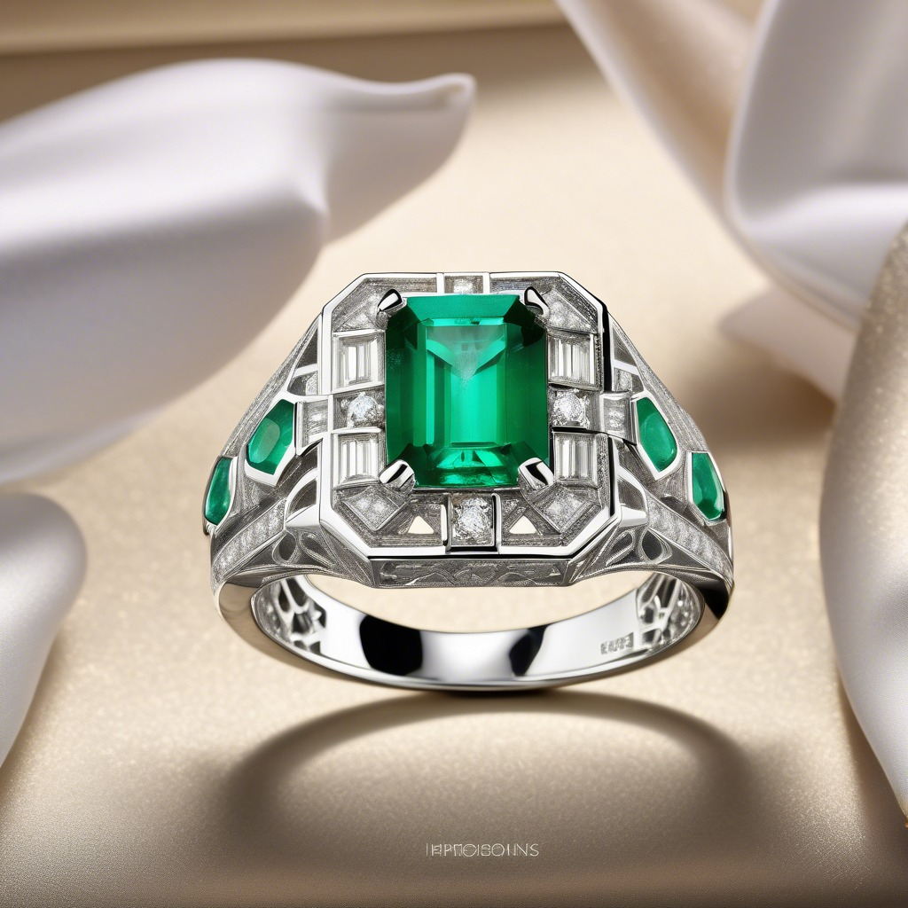<br><em>Emerald ring in 18k white gold,<br>art deco style</em></td>
    <td align="center">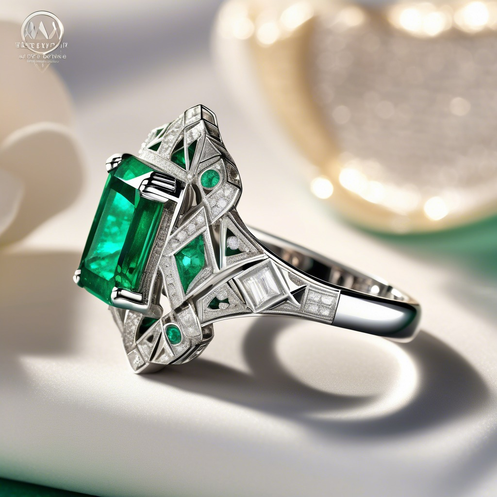<br><em>Emerald ring — side view,<br>geometric filigree detailing</em></td>
    <td align="center">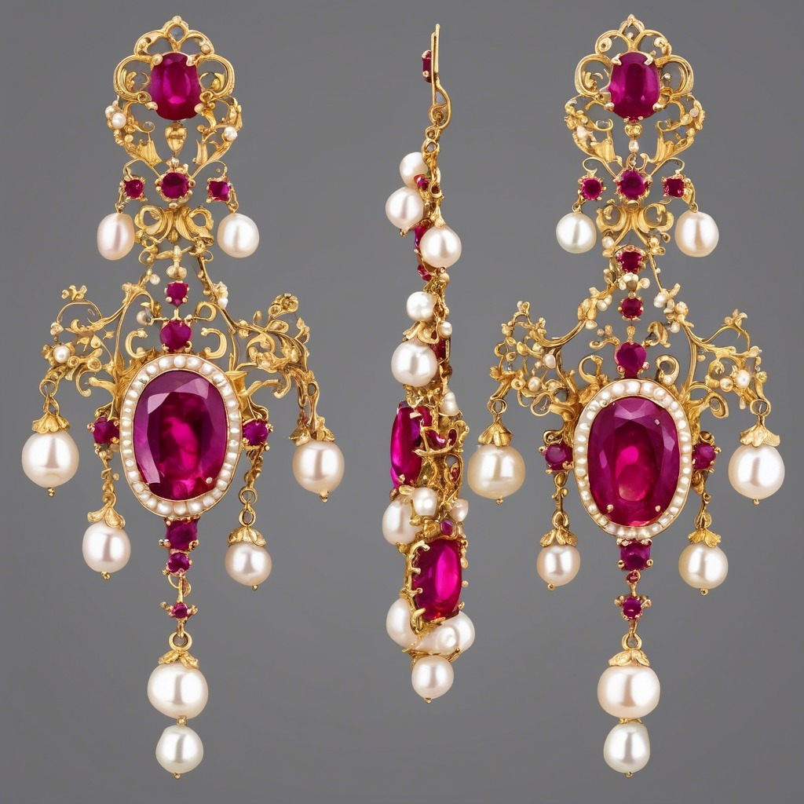<br><em>Chandelier earrings with<br>rubies and pearls</em></td>
  </tr>
  <tr>
    <td align="center">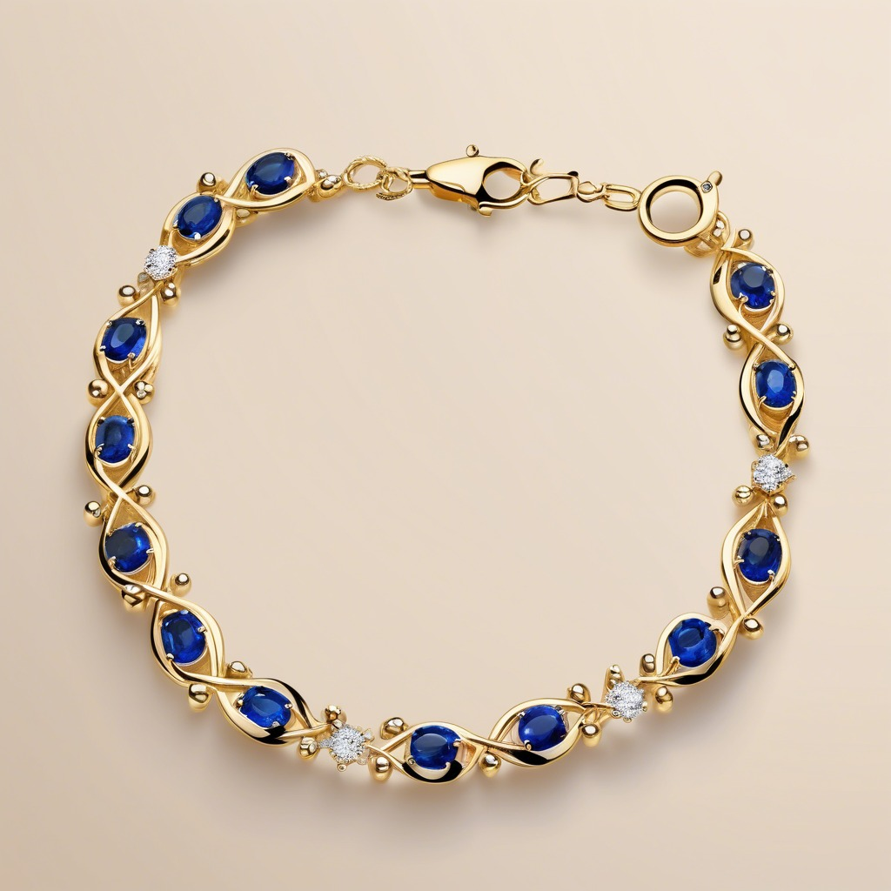<br><em>Gold bracelet with<br>sapphire gemstones</em></td>
    <td align="center">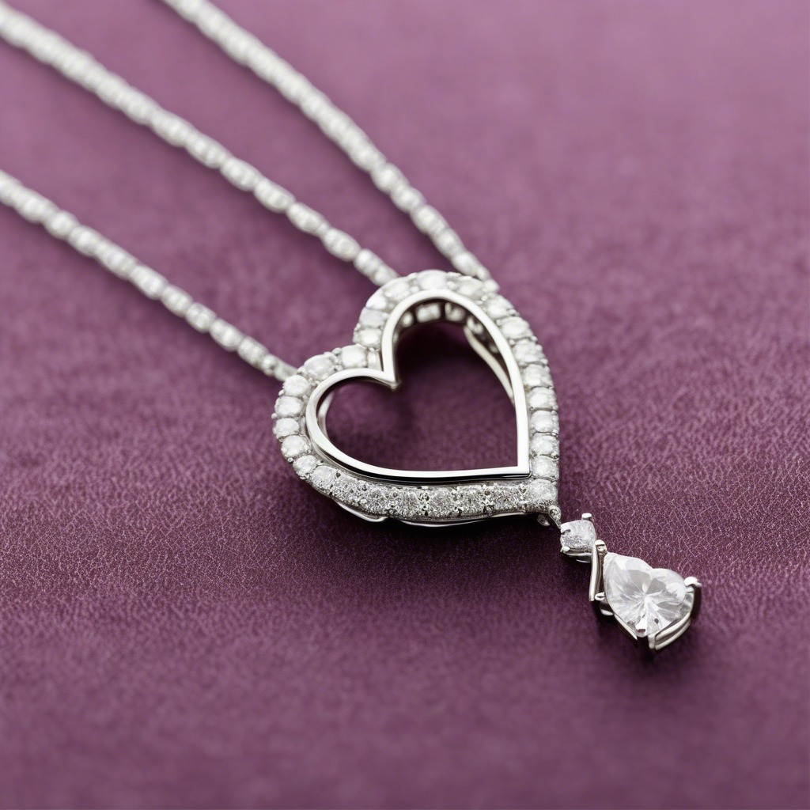<br><em>Diamond heart pendant<br>in white gold</em></td>
    <td align="center">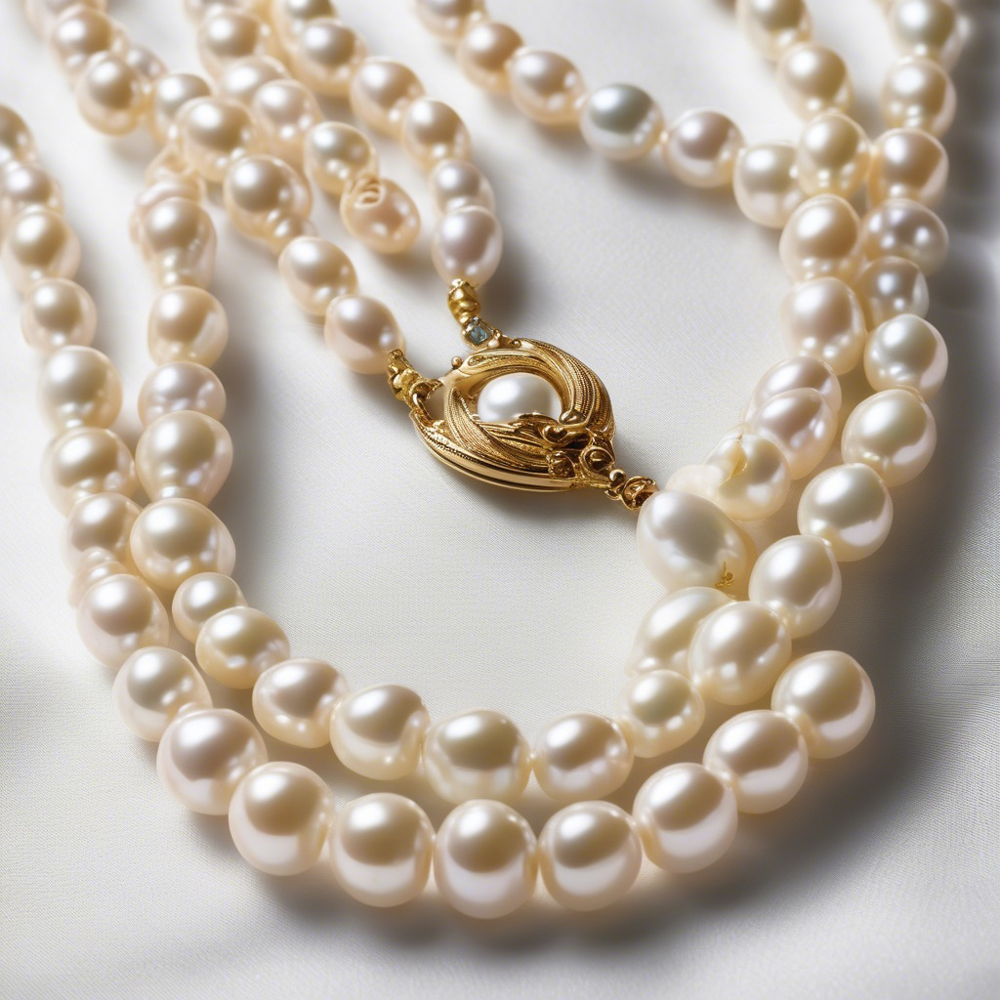<br><em>Multi-strand pearl necklace<br>with gold clasp</em></td>
  </tr>
  <tr>
    <td align="center">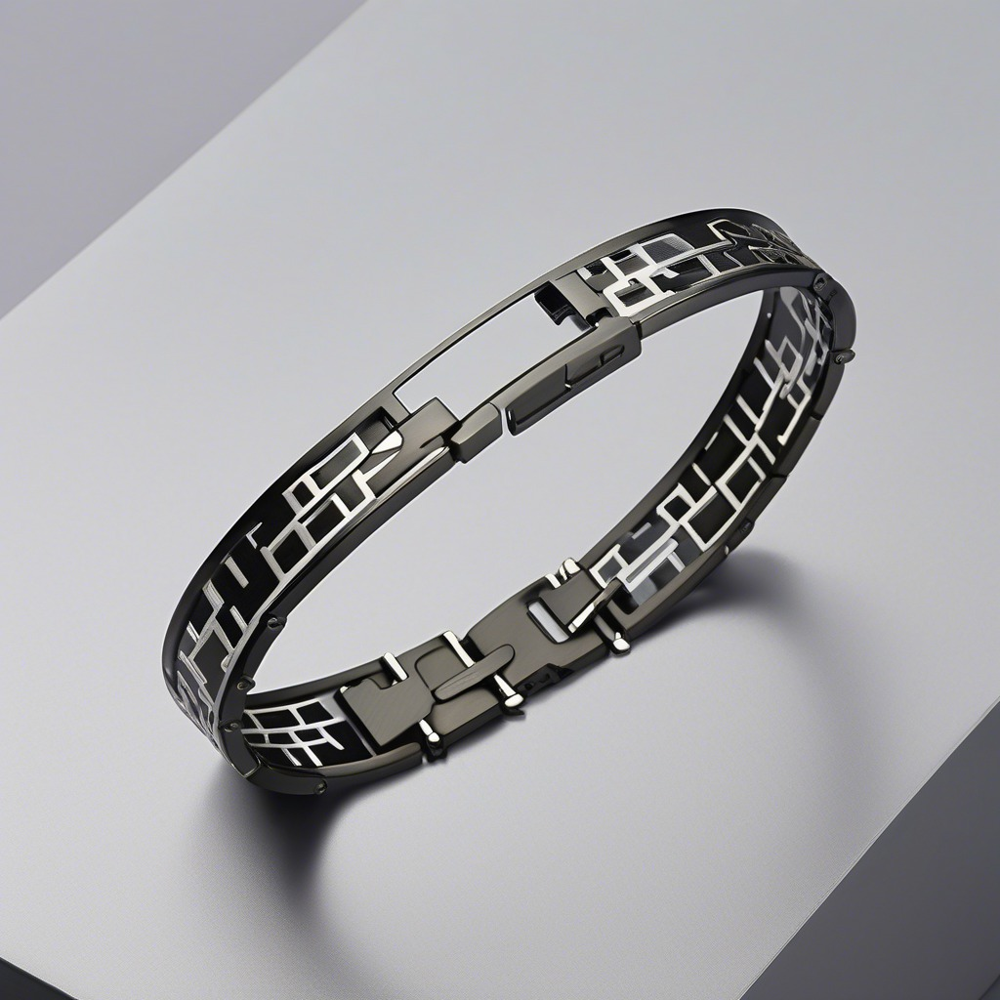<br><em>Minimalist titanium bracelet,<br>geometric patterns</em></td>
    <td align="center"><br><em>Stackable silver rings with<br>colorful gemstones</em></td>
    <td align="center">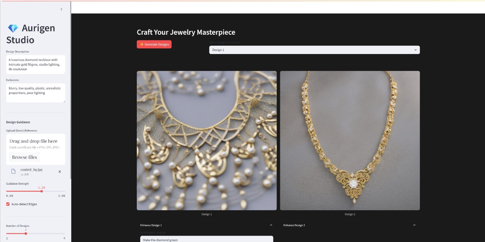<br><em>Gold necklace with intricate<br>filigree and pearls</em></td>
  </tr>
</table>

> All images above were generated by the fine-tuned model from text prompts alone.

## Architecture

```
                          ┌─────────────────────┐
    Text Prompt ─────────>│  CLIP Text Encoder   │──── Text Embeddings
                          │  (Dual Encoder)      │         │
                          └─────────────────────┘         │
                                                           ▼
                          ┌─────────────────────┐   ┌───────────┐
    Reference Image ─────>│  Canny Edge          │──>│           │
    (Optional Sketch)     │  Detection           │   │   UNet    │──── Predicted Noise
                          └─────────────────────┘   │  (Fine-   │
                                    │               │  tuned)   │
                          ┌─────────────────────┐   │           │
                          │  ControlNet          │──>│           │
                          │  (Structural Guide)  │   └───────────┘
                          └─────────────────────┘         │
                                                           ▼
                                                   ┌───────────┐
                                                   │    VAE     │──── Generated Image
                                                   │  Decoder   │     (1024 x 1024)
                                                   └───────────┘
```

**Key Components:**

| Component | Role |
|-----------|------|
| **Stable Diffusion XL** | Base text-to-image model generating 1024x1024 images |
| **ControlNet (Canny)** | Structural guidance from sketches via edge detection |
| **Fine-tuned UNet** | Domain-adapted on 6,157 jewelry images for realistic designs |
| **Dual CLIP Encoders** | Text understanding for prompt-to-embedding conversion |
| **VAE** | Latent space encoding/decoding for high-res output |

## Dataset

A custom jewelry dataset curated from Roboflow, Kaggle, images.cv, GitHub, and Hugging Face. Captions were generated using **Gemini API** (image-to-text) and manually verified.

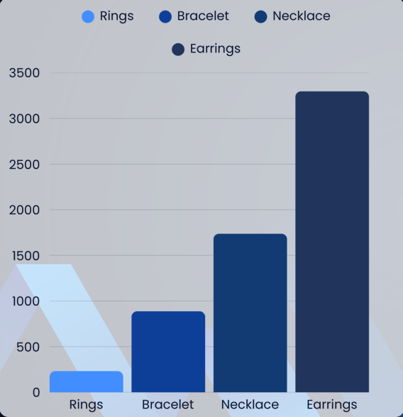

| Category | Images | Source |
|----------|--------|--------|
| Earrings | 3,298 | Multiple sources, manually cleaned |
| Necklaces | 1,738 | Multiple sources, manually cleaned |
| Bracelets | 888 | Multiple sources, manually cleaned |
| Rings | 233 | Multiple sources, manually cleaned |
| **Total** | **6,157** | **Annotated with text descriptions** |

<p align="center">
  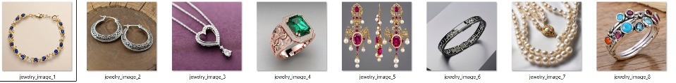
  <br><em>Sample images from the curated jewelry dataset</em>
</p>

## Training

The SDXL UNet was fine-tuned on the jewelry dataset using the following configuration:

| Parameter | Value |
|-----------|-------|
| Base Model | `stabilityai/stable-diffusion-xl-base-1.0` |
| ControlNet | `diffusers/controlnet-canny-sdxl-1.0` |
| Image Size | 512 x 512 (training) / 1024 x 1024 (inference) |
| Batch Size | 8 (with gradient accumulation x4) |
| Learning Rate | 1e-5 |
| Epochs | 3 |
| Precision | FP16 (mixed precision) |
| Optimizer | AdamW |
| Scheduler | DDPM |
| GPU | NVIDIA (CUDA 12.8) |
| Weights Saved | `unet_epoch_3.pth` |

## Streamlit App

An interactive design studio for real-time jewelry generation and refinement.

<p align="center">
  
  <br><em>Aurigen Studio — Generate and refine jewelry designs in real-time</em>
</p>

**Features:**

- **Text-to-Image** — Describe your jewelry and generate multiple designs instantly
- **Sketch Upload** — Upload reference images or sketches for structural guidance
- **Edge Detection** — Auto Canny edge detection for ControlNet conditioning
- **Iterative Refinement** — Modify specific designs after generation (e.g., "make the diamond green")
- **Adjustable Parameters** — Guidance strength, inference steps (20–100), prompt adherence, number of designs (1–4)

**Demo:** [Watch on Google Drive](https://drive.google.com/file/d/1UnwEjkt5vYjoJlum6DXiLO72CQdbBcFo/view?usp=sharing)

## Project Structure

```
Aurigen-AI-Powered-Jewelry-Design-Studio/
├── controlnet_app.py              # Streamlit app (SDXL + ControlNet pipeline)
├── old_training_file.ipynb        # Full training pipeline (UNet fine-tuning)
├── new_training_file.ipynb        # Alternate training experiments
├── dataset_labels.csv             # 6,157 image-caption pairs
├── requirements.txt               # Python dependencies
├── Dataset/
│   ├── bracelet/                  # 888 images
│   ├── earring_best/              # 3,298 images
│   ├── necklace/                  # 1,738 images
│   └── ring_best/                 # 233 images
├── Assets/                        # Banner, sample outputs, dataset chart
├── Documents/
│   ├── images/                    # Generated design samples
│   ├── Aurigin.pptx               # Project presentation
│   └── Aurigen - Jewelry Design Studio.pdf
└── LICENSE
```

## Tech Stack

| Area | Technologies |
|------|-------------|
| Core Models | Stable Diffusion XL, ControlNet |
| ML Frameworks | PyTorch, Hugging Face Diffusers, Transformers |
| Image Processing | OpenCV (Canny edge detection), PIL, NumPy |
| Dataset Annotation | Gemini API (image-to-text), manual verification |
| Frontend | Streamlit |

## Getting Started

```bash
git clone https://github.com/sidd707/Aurigen-AI-Powered-Jewelry-Design-Studio.git
cd Aurigen-AI-Powered-Jewelry-Design-Studio
pip install -r requirements.txt
```

**Download the fine-tuned weights** from [Google Drive](https://drive.google.com/drive/folders/13bx0xMu9Py2vFqFG8ocny2YVamw7EQOX?usp=sharing) and place them in a `fine-tuned-weights/` folder.

```bash
streamlit run controlnet_app.py
```

## Team

- [Siddharth Patel](https://github.com/sidd707) — Model Development, Dataset (Rings)
- [Sarthak Chauhan](https://github.com/CodeNinjaSarthak) — Model Development, Dataset (Bracelets)
- Vrinda Singh Parmar — Model Development, Dataset (Necklaces)
- Shlok Bhardwaj — Model Development, Dataset (Earrings)
- Saksham Dhiman — Research, Fine-Tuning
